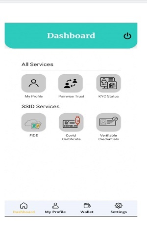
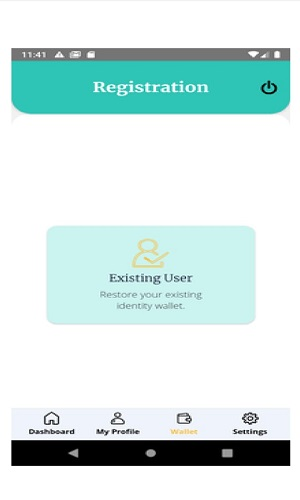
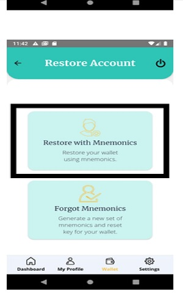
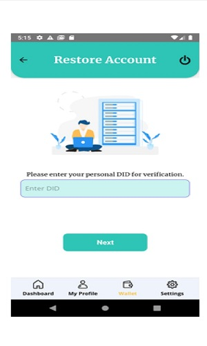
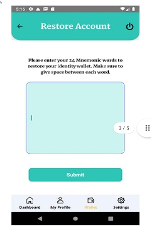
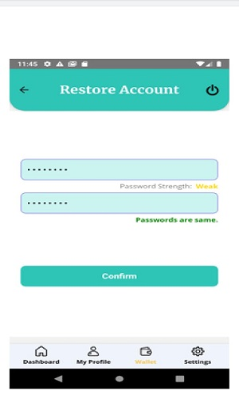
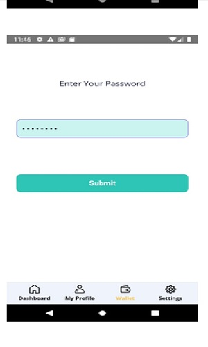
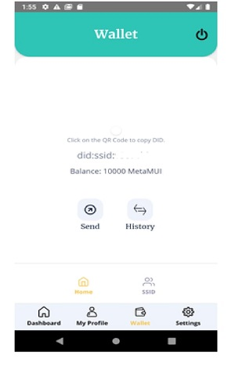

# Restrore wallet

**Step 1:**  
If the have uninstalled & installed the app agian or logged Out, then you an againsign in to the app by using email address & password to land on Dashboard sacreen.  
**Step 2:**  
Click the `wallet` icon at the bottom.  

  

**Step 3:**  
Click the Existing user button.  

  

**Step 4:**  
Click the `Restore` with `Mnemonics` button.  

  

**Steep 5:**  
Enter your personal DID for verification, then click `Next` Button.  

  

**Step 6:**  
Enter your 24 mnemonic words to restore your identity wallet.Make sure to give space between each word. Just copy & paste your  
mnemonics into the text area. Then click the `submit` button.  

  

**Step 7:**  
Set a new password for your wallet & `confirm`.  

  

**Step 8:**  
Enter your new wallet password & `submit`  

  

**Step 9:**  
you are ready to do use your wallet now. 

  