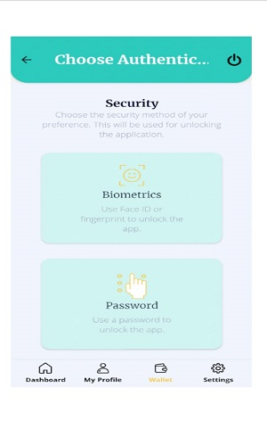
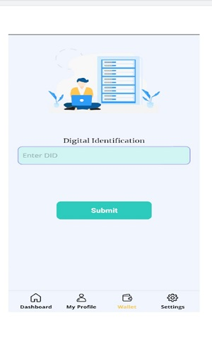
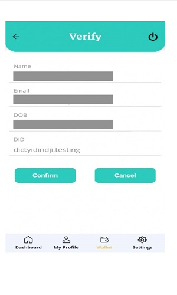
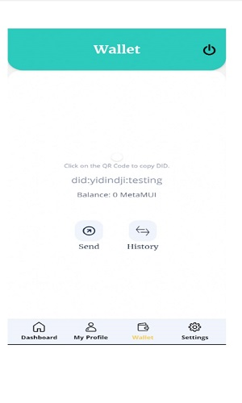

# Password And Biometrics Setup
**Step 8:**  
Set up ***Authentication System*** for extra security by clicking on Biometrics or Password.  
``This password is only to unlock your wallet inside the app   
(This is not related to Login Password).``

`Biometrics is optional, those who wants to use Face Id or  
Fingerprint then opt for that option. It will also ask for a  
password, if Biometrics unlock fails then you can use the  
password.`  

  

**Step 9:**  
Now save your 24 Mnemonics (seed words)somewhere safeby `copying them`.  
:::caution
This is the most important step.Your 24 memonics are   
used to restore your DID if you log out or Uninstall the app.
:::  

  

**Step 10:**  
Enter a DID as per your choice and then Click on `Submit`.  
  

**Step 11:**  
Verify your details in this screen and click on `Confirm` to proceed further.  

  

**Step 12:**  
After following on screen information you will able to generate your VC successfully.  
Then can see your generated Wallet in `Wallet` tab.  

  